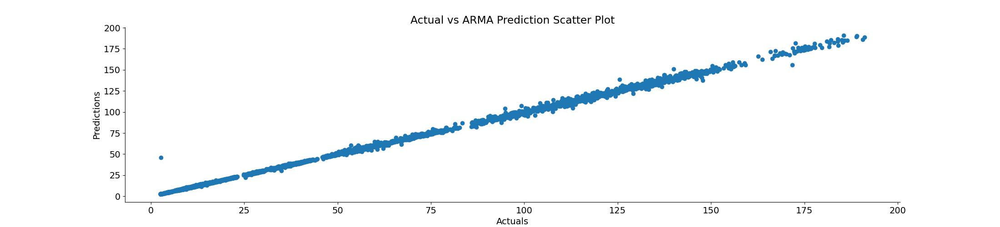
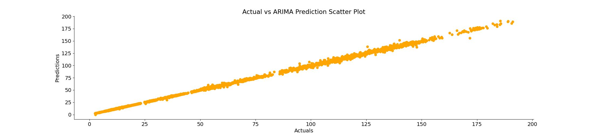

# Understanding ARIMA and ARMA Models

## Introduction

This project aims to provide a comprehensive understanding of ARIMA (AutoRegressive Integrated Moving Average) and ARMA (AutoRegressive Moving Average) models. 

These models are fundamental in time series analysis, enabling us to analyze historical data, identify patterns, and make predictions for future values.

---

## Table of Contents

1. [Overview](#overview)
2. [Prerequisites](#prerequisites)
3. [ARMA Model](#arma-model)
    - [Autoregressive (AR) Part](#autoregressive-ar-part)
    - [Moving Average (MA) Part](#moving-average-ma-part)
4. [ARIMA Model](#arima-model)
    - [Integrated (I) Part](#integrated-i-part)
5. [Model Building Process](#model-building-process)
6. [Conclusion](#conclusion)
7. [References](#references)

---

## Overview

ARMA and ARIMA models are essential tools in time series forecasting and analysis. They allow us to model and predict future values based on historical data patterns, making them valuable in fields like finance, economics, and meteorology.

---

## Prerequisites

Before diving into ARIMA and ARMA models, familiarity with the following concepts is recommended:

- Time Series Data
- Statistical concepts (mean, variance, autocorrelation)
- Basic Python programming
    - Libraries: `pandas`, `numpy`, `statsmodels`, `matplotlib`

---

## ARMA Model

The ARMA Model combines Autoregressive (AR) and Moving Average (MA) components to model time series data.

### Autoregressive (AR) Part

The AR part models the current value of the series as a linear combination of its own past values.

**Formula:**
$$X_t = c + \sum_{i=1}^{p} \phi_i X_{t-i} + \epsilon_t$$

We were able to make decent predictions as seen below using the ARMA Model

### Moving Average (MA) Part

The MA part models the current value of the series as a linear combination of past error terms.

**Formula:**
$$X_t = \mu + \sum_{i=1}^{q} \theta_i \epsilon_{t-i} + \epsilon_t$$

----

## ARIMA Model

The ARIMA model extends the ARMA model by incorporating differencing to achieve stationarity.

### Integrated (I) Part

The integrated part involves differencing the time series data to make it stationary. This step is crucial for stabilizing the mean and variance of the series.

---

## Model Building Process

1. **Data Preparation:** Format your data into a proper time series format.
2. **Stationarity Check:** Ensure the time series is stationary using tests like the Augmented Dickey-Fuller test.
3. **Parameter Selection:** Determine model parameters (`p`, `d`, `q`) using tools like ACF and PACF plots.
4. **Model Training:** Fit the ARIMA model to your data.
5. **Model Evaluation:** Assess model performance using metrics such as AIC, BIC, and residual analysis.

Below is a chart that displays the actual values and the predictions made on stock data by our ARIMA model where the p,d and q values were 1,1,0.

---

## Conclusion

Understanding ARIMA and ARMA models equips analysts with powerful tools for time series forecasting and analysis. These models capture underlying patterns in data and facilitate informed decision-making in various domains.

---

## References

1. Hyndman, R. J., & Athanasopoulos, G. (2018). Forecasting: principles and practice. OTexts.
2. Box, G. E. P., Jenkins, G. M., Reinsel, G. C., & Ljung, G. M. (2015). Time Series Analysis: Forecasting and Control. Wiley.
3. [Statsmodels Documentation](https://www.statsmodels.org/)
4. [ARIMA Model - Wikipedia](https://en.wikipedia.org/wiki/Autoregressive_integrated_moving_average)
