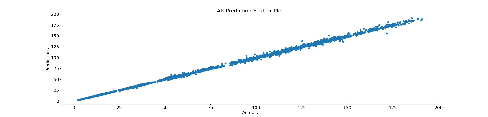
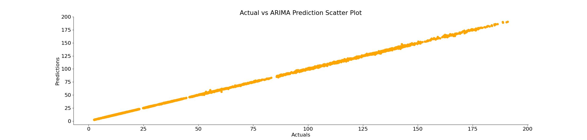

# Understanding ARIMA and ARMA Models

## Introduction

This project aims to provide a clear understanding of ARIMA (AutoRegressive Integrated Moving Average) and ARMA (AutoRegressive Moving Average) models. 

These models are essential tools in analyzing time series data, which is data collected over time. They help us identify patterns in historical data and make predictions about future values.

---

## Table of Contents

1. [Overview](#overview)
2. [Prerequisites](#prerequisites)
3. [ARMA Model](#arma-model)
    - [Autoregressive (AR) Part](#autoregressive-ar-part)
    - [Moving Average (MA) Part](#moving-average-ma-part)
4. [ARIMA Model](#arima-model)
    - [Integrated (I) Part](#integrated-i-part)
5. [Model Building Process](#model-building-process)
6. [Conclusion](#conclusion)
7. [References](#references)

---

## Overview

ARMA and ARIMA models are powerful tools for forecasting and analyzing time series data. They allow us to predict future values based on patterns found in past data, making them useful in various fields like finance, economics, and weather forecasting. 

We cannot use regression models in time series data (data that has time element attached to it) which is why we will have to resort to ARMA and ARIMA models for prediction.

---

## Prerequisites

Before diving into ARIMA and ARMA models, it's helpful to understand the following concepts:

- **Time Series Data:** Data points collected or recorded at specific time intervals.
- **Statistical Concepts:** Basic knowledge of mean (average), variance (how spread out the data is), and autocorrelation (how data points relate to each other over time).
- **Basic Python Programming:** Familiarity with Python and libraries like `pandas`, `numpy`, `statsmodels`, and `matplotlib` for data manipulation and visualization.

---

## ARMA Model

The ARMA Model combines two components: Autoregressive (AR) and Moving Average (MA) to analyze time series data.

### Autoregressive (AR) Part

The AR part predicts the current value of the series based on its own past values.

**Formula:**
$$X_t = c + \sum_{i=1}^{p} \phi_i X_{t-i} + \epsilon_t$$

This means that the current value is influenced by previous values, plus some error term.

We were able to make decent predictions using the ARMA Model, as shown below:

### Moving Average (MA) Part

The MA part predicts the current value based on past errors (the differences between predicted and actual values).

**Formula:**
$$X_t = \mu + \sum_{i=1}^{q} \theta_i \epsilon_{t-i} + \epsilon_t$$

This means that the current value is influenced by past errors, plus a constant.

----

## ARIMA Model

The ARIMA model builds on the ARMA model by adding a step called differencing to make the data stationary (stable over time).

### Integrated (I) Part

The integrated part in ARIMA involves adjusting the time series data to remove trends and seasonality, making it easier to analyze. 

We basically difference the time series as many times as needed to get to a series of data where we don't see any seasonality and trends.

---

## Model Building Process

1. **Data Preparation:** Organize your data into a time series format.
2. **Stationarity Check:** Ensure the time series is stable using tests like the Augmented Dickey-Fuller test.
3. **Parameter Selection:** Choose model parameters (`p`, `d`, `q`) using tools like ACF and PACF plots, which help visualize the data.
4. **Model Training:** Fit the ARIMA model to your data to learn from it.
5. **Model Evaluation:** Assess how well the model performs using metrics like AIC, BIC, and residual analysis.

Below is a chart that displays the actual values and the predictions made on stock data by our ARIMA model, where the parameters were set to 1, 1, and 0 (p, d an q values).

---

## Conclusion

Understanding ARIMA and ARMA models provides analysts with valuable tools for forecasting and analyzing time series data. 

These models help uncover patterns in data, enabling better decision-making across various fields.

---

## References

1. Hyndman, R. J., & Athanasopoulos, G. (2018). Forecasting: principles and practice. OTexts.
2. Box, G. E. P., Jenkins, G. M., Reinsel, G. C., & Ljung, G. M. (2015). Time Series Analysis: Forecasting and Control. Wiley.
3. Statsmodels Documentation - [Link](https://www.statsmodels.org/)
4. Wikipedia - [ARIMA Model](https://en.wikipedia.org/wiki/Autoregressive_integrated_moving_average)
